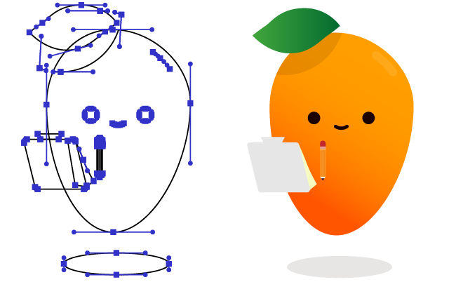

# Outliner

Illustrator script to convert all artwork to a "permanent outline" mode, replacing all Appearances and manually drawing all anchors/handles:

_Result of script on left, original artwork on right._

Created for practice, and by request of a reddit thread: [Is there a way to export an outline view + anchorpoints?](https://www.reddit.com/r/AdobeIllustrator/comments/e0nh4m/is_there_a_way_to_export_an_outline_view/)

[Adobe thread explaining certain issues I ran into and solutions once solved](https://community.adobe.com/t5/illustrator/practice-script-to-convert-art-to-quot-permanent-outlines-quot-drawing-anchors-and-handles-what-s/td-p/10759175)
