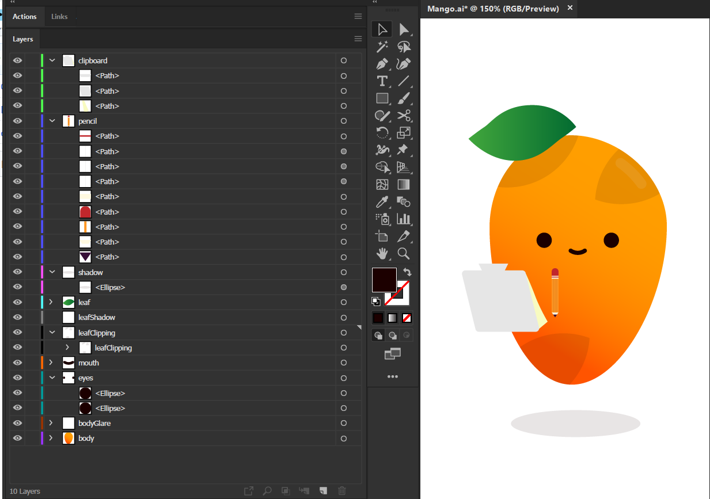
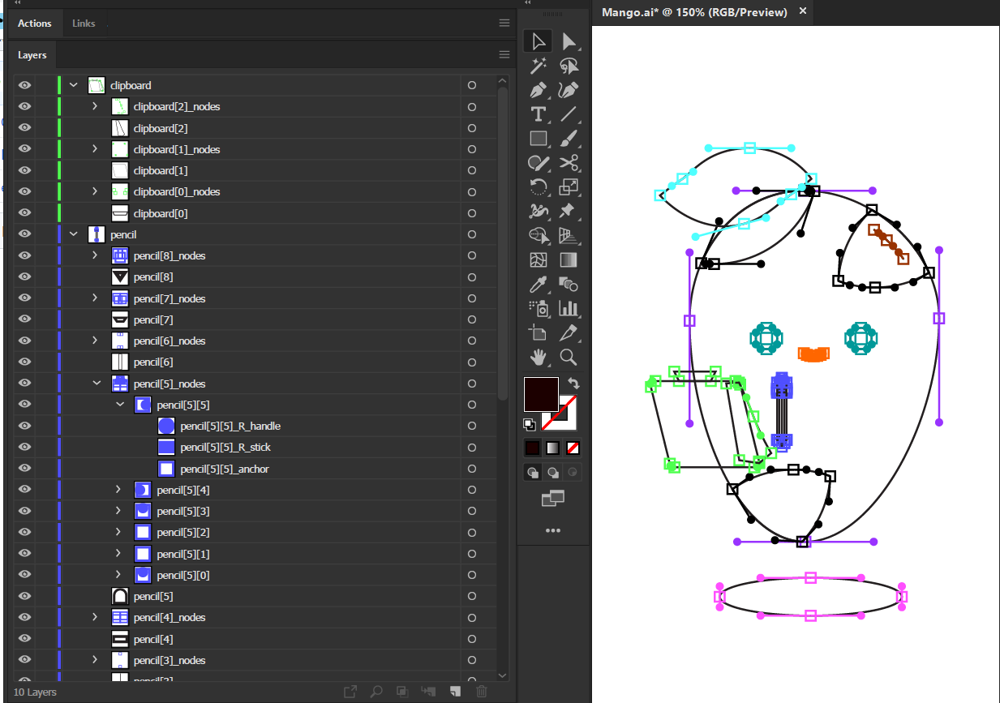

# Outliner

Illustrator script to convert all artwork to a "permanent outline" mode, replacing all Appearances and manually drawing all anchors/handles:

_Result of most basic options on left, original artwork on right_

- Variable sizes for all results including anchors, strokes, outlines, handles.
- Customizeable color for all outlines and anchors/handles or optional inherit parent layer label color
- Smart name assignment with customizeable variables per item
- Smart handle generation only on points needing them
- Optional override complex appearances (stacked strokes/fills)
- Optional merge Clipping Masks (perform intersect on all mask children)
- Optional override opacity of any path
- Optional deep grouping per handle and collection of handle groups per anchor
- Smart sorting: anchors/handles appear in same Layer as target and just above it's zOrder

## Before

_Artwork with various clipping masks and unnamed paths_

## After

_Outliner can merge all masks, inherit layer label color, rename all targets, deeply organize them by handle and anchor_

---

Created for practice, and by request of a reddit thread: [Is there a way to export an outline view + anchorpoints?](https://www.reddit.com/r/AdobeIllustrator/comments/e0nh4m/is_there_a_way_to_export_an_outline_view/)

[Adobe thread explaining certain issues I ran into and solutions once solved](https://community.adobe.com/t5/illustrator/practice-script-to-convert-art-to-quot-permanent-outlines-quot-drawing-anchors-and-handles-what-s/td-p/10759175)
